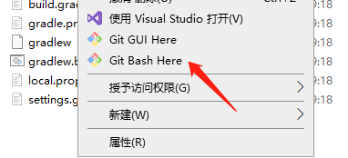

## 1.安装[git](https://git-scm.com/downloads/)
## 2.建立本地仓库

  1.进入到要提交的代码文件根目录，右键，选择Git Bash Here
  
  
  2.输入：git init //创建仓库
  
  3.输入：git add . //在仓库中加入当前目录所有文件
  
  4.输入：git status //查看当前git状态

## 3.上传到远程仓库
