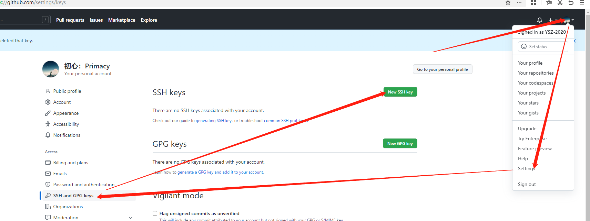
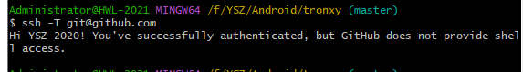
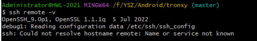
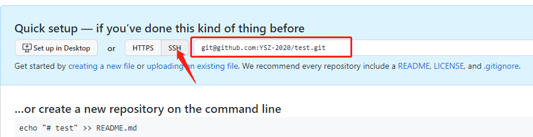

## 1.安装[git](https://git-scm.com/downloads/)
## 2.建立本地仓库
  1.进入到要提交的代码文件根目录，右键，选择Git Bash Here
  
  
  2.输入：git init //创建仓库
  
  3.输入：git add . //在仓库中加入当前目录所有文件
  
  4.输入：git status //查看当前git状态

## 3.上传到远程仓库
  1.输入：git config --global user.name "YSZ-2020" 设置用户名
    输入：git config --global user.email "651897335@qq.com" 设置邮箱名
    输入：git config --global user.password "Ysz741700381" 设置密码
    上面命令，如果不跟双引号内容，则可当查询命令用
    
  2.输入命令：ssh-keygen -t rsa -C "651897335@qq.com"，然后一路Enter键，如果提示是否Overwrite，输入y表示覆盖，最后会在C:\Users\Administrator\.ssh目录下找到id_rsa.pub文件
    用记事本打开它，复制里面的内容
  
  3.如下图，在github上新建一个ssh
    
  
    将复制的内容粘贴进key中去，并点击Add ssh key提交保存
  
  4.输入：ssh -T git@github.com 会返馈类似下图这样的成功信息
    
  
    输入：ssh remote -v可以查看远程状态，如果是第一次，则有可能不显示任何内容，否则会显示下图信息，稍等一会，才会退出本命令
    
  
  5.在github上新建一个仓库，例如，新建为test，如下图，点击SSH后，得到SSH地址，复制这个地址
    
  
  6.输入：git remote add origin git@github.com:YSZ-2020/test.git 添加远程仓库地址
  
  7.输入：git commit -m "first commit" -a 提交仓库，注意，双引号中的first commit可以是任意内容，如果没有这个内容，github会任何提交内容非法
    输入：git push -u origin master 将仓库内容更新到github上的master分支中
    
  8.以后更新了本地什么文件，只需要：
    输入：git add file.cpp（更新了的文件）
    输入：git commit -m "一些信息"
    输入：git push -u origin master
    
    

